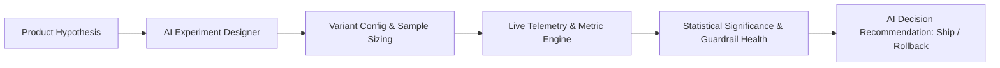

# 🧪 AI Product Experimentation Platform

<p align="center">
  <strong>A portfolio-grade product decision operating system for designing, monitoring, analyzing, and deciding A/B product experiments.</strong>
</p>

<p align="center">
  <a href="#license"></a>
  <a href="https://nextjs.org"></a>
  <a href="https://react.dev"></a>
  <a href="https://www.typescriptlang.org"></a>
  <a href="https://deepseek.com"></a>
  <a href="https://workers.cloudflare.com"></a>
</p>

---

## 📌 Overview

**AI Product Experimentation Platform** is a modern decision-support system built for Product Managers, Growth Leads, and Data Scientists. It replaces chaotic spreadsheet tracking with a unified workflow: from **hypothesis design and MDE power calculations** to **real-time telemetry monitoring, guardrail health tracking, and AI-synthesized rollout recommendations**.

---

## ✨ Key Features

- **📊 Portfolio Command Center:** Real-time visibility into active experiments, portfolio win rates, average time-to-learn, and active segment risks.
- **🔬 3-Step AI-Assisted Experiment Designer:**
  - Formulates testable hypotheses, target audience segments, and variant splits.
  - Automatically identifies **Primary KPIs**, **Secondary Metrics**, and **Guardrail Metrics** (e.g. latency, error rates, drop-offs).
  - Calculates Minimum Detectable Effect (MDE) and sample size requirements.
- **📈 Live Experiment Telemetry & Statistical Significance:**
  - Conversion trends, confidence interval visualization, and p-value statistical significance alerts.
  - Detects segment-specific anomalies (e.g. high Android checkout abandonment despite overall iOS conversion lift).
- **🤖 AI Decision Briefs & Rollout Control:**
  - Generates auditable **Ship / Iterate / Rollback** recommendations with business justification.
  - Supports progressive feature rollout controls from 1% to 100%.
- **🛡️ Provider-Agnostic AI Backend:** DeepSeek V3 primary engine with Anthropic Claude fallback and offline demo simulation mode.

---

## 🏗️ Architecture



---

## 🚀 Quick Start

### Prerequisites
- **Node.js:** v20+ or v22+
- **AI Key:** (Optional) `DEEPSEEK_API_KEY` or `ANTHROPIC_API_KEY`

### Installation

```bash
# Clone the repository
git clone https://github.com/MadanMohan0537/ai-product-experimentation-platform.git
cd ai-product-experimentation-platform

# Install dependencies
npm install

# Configure environment variables
cp .env.example .env.local
# Add your DEEPSEEK_API_KEY or ANTHROPIC_API_KEY (optional: app runs in demo mode without keys)

# Start development server
npm run dev
```

Open [http://localhost:3000](http://localhost:3000) in your browser.

---

## 🛠️ Tech Stack

- **Framework:** Next.js 15 (App Router), React 19
- **Language:** TypeScript
- **Styling:** TailwindCSS, Modern CSS
- **AI Integrations:** DeepSeek API, Anthropic Claude SDK
- **Runtime:** Cloudflare Workers (Vinext) / Vercel

---

## 📄 License

MIT License — see [LICENSE](LICENSE) for details.
